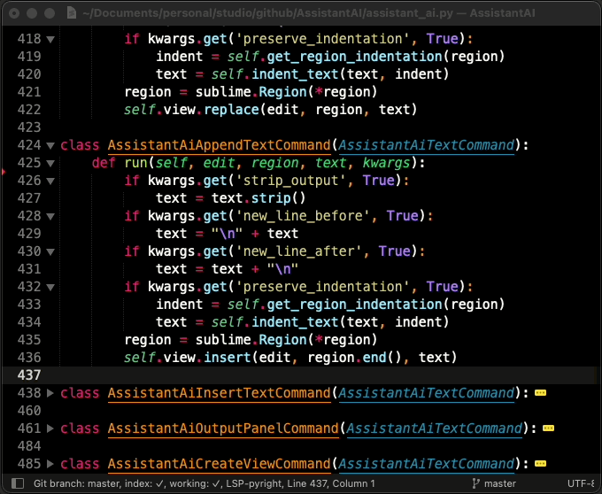

# AssistantAI

A Sublime Text plugin to interact with HTTP API endpoints and perform text manipulation with their responses. AssistantAI is bundled with OpenAI to interact with ChatGPT or Codex, Gitea to create Issues directly from the selected code, and Python prompts to automatically add Docstrings and more. The user can extend it's features by defining Server endpoints and custom Prompts in Sublime Settings JSON files.

<p align="center">
	</img>
</p>

AssistantAI provides general purpose implementation of an HTTP API client that allows perform text manipulation with remote API responses, as a result to requests based on selected text and optional user input. Can be extended by the user or by other packages, providing servers, endpoints, prompt templates and credentials placeholders, defined in Sublime Settings files, in JSON.

A common use case is to consume API of, for instance, Generative AIs like ChatGPT or OpenAI Codex, to complete, edit, comment or explain selected code chunks. Another example is to consume GitHub, Gitea or similar VCS server's API to add Issues from the selected code, without leaving Sublime Text. 

# Privacy warning

Selected code, file path, name, file size and symbols may be sent to the remote third party API servers for processing (i.e.: OpenAI, see below), so make sure you have the necessary permissions to do so.

# Installation

The plugin is available in [Package Control](https://packagecontrol.io/packages/AssistantAI). 

Installing the plugin via Package Control is the recommended option:

- Invoke Command Palette (`Cmd` + `Shift` + `P`)
- Search for "Package Control: Install Package"
- Search for "AssistantAI" and install it

Once installed, check the settings menu in `Settings` > `Package Settings` > `AssistantAI`, which includes:

- `Settings`: General AssistantAI plugin settings. A place to add your custom prompts and servers.
- `Key Bindings`: Example Key Bindings for invoking AssistantAI prompt selection panel and more.

Also bundled with the plugin you can configure:

- `OpenAI Server Settings`: Definition for ChatGPT completion API endpoints and general prompts.
- `Gitea Server Settings`: Definition for Gitea Issue creation endpoint.
- `Python Prompts`: Definition of Python-specific prompts (i.e.: to add a Doctring to selected code using OpenAI).

And for when you have at least one configured Server (see below):

- The `AssistantAI` command in the command palette.

## Settings

AssistantAI is configured, and extended, using Sublime JSON settings files. The plugin provides several files for each service or syntax specific definitions (i.e.: one for OpenAI, another for Gitea, for Python, and more to come), where each file follows the same structure:

- `credentials`: Empty by default. You should overwrite this entry with your credentials for that server as described below.
- `prompts`: Empty by default. Overwrite it to add (or import and refine) your custom prompts.
- `servers`: Empty by default. Overwrite it to add (or import and refine) your custom servers. 
- `default_prompts`: Prompts provided by the package. You should not overwrite this entry.
- `default_servers`: Servers provided by the package. You should not overwrite this entry.

Your custom settings files may include `credentials` to enable the server, thus making all prompts depending on it available for when you invoke AssistantAI command. If you add custom prompts or servers, then `prompts` and `servers` may be present too in your custom files. 

> What should be never present in your custom files are `default_prompts` and `default_servers`. If you want to create a server based on a default one, you can use a `import` as described in advanced topics or in the examples in the settings files.

The files are named following this convention:

- `assitant_ai.sublime-settings` for the general settings.
- `assitant_ai_{NAME}.sublime-settings` for the service or syntax specific settings files.

Currently, at the very least, you should configure the API KEY of OpenAI, or API TOKEN of Gitea, to play with the plugin.

Everything can be configured with Sublime JSON settings with a very high degree of flexibility.

## Key Bindings and Commands

An example of key bindings file is provided to bind keyboard shortcuts to AssistantAI commands, so you can quickly get the available prompt list based on the current context or directly invoke a prompt.

There are two commands you can invoke with a Key Binding:

- `AssistnatAI Prompt`: identified as `assistant_ai_prompt`. This command is also available in the Command Palette. When invoked without arguments shows a list of prompts that can be used, given the configured servers, selected text, buffer syntax, etc (i.e.: the context). To directly invoke a prompt, you can pass arguments:
	+ `pid`: Prompt ID
	+ `eid`: Endpoint ID
	+ `...`: Any required input argument required by the prompt.

- `AssistnatAI Dump`: identified as `assistant_ai_dump`. Used for debugging. Dumps all loaded settings and displays in a new buffer, so you can inspect what is being loaded. When you start playing with `import` for servers and prompts, you may need to know what has been processed by AsistantAI.

If no prompts are available, `AssistantAI` command does nothing else than show a status bar message warning.

# Usage

Once installed and configured, invoke `AssistantAI` from the command palette, select a prompt from the presented list and follow it's flow.

Prompts are offered based on the context (configured servers, selected text, buffer syntax, available content, etc.), and as per specifications provided by the prompt it self.

Without any configured server, there will be no prompts available.

The general flow is simple. For instance:

- Select a text region (i.e.: A code function, or Markdown section).
- Command Palette > `AssistantAI` (or the keyboard shortcut if you set up one).
- Select a **prompt**.
- If the prompt needs additional **inputs**, those will be requested using the UI.
- When several **servers** with valid **endpoints** qualifies for the selected prompt, a list of endpoints is presented.

Once AssistantAI have a prompt, with all needed inputs and the target endpoint is selected, it builds an HTTP payload based on that and makes the network request.

The response is parsed based on the endpoint specification and its specified **command** is executed.

The prompt may specify another action instead of text manipulation (replace, append, prepend, insert), such as show the response in an Output Panel, or a new Buffer.

As an example, consider this flow using the bundled OpenAI server endpoints definition (requires credentials) plugin while editing a Python file:

- Select a python function
- Ask AssistantAI for the prompt "Add python docstring"
- *Since only one endpoint qualifies, a request is made to OpenAI without further inputs*
- The python docstring is added to the selected function as returned by ChatGPT

# What's included with this plugin?

The plugin implements the parser of the settings files where the servers, prompts and credentials are configured (by this package, another package, or the user). Manages the filtering of the prompts that are available given a context, and takes care of the API requests, building payloads, parsing responses, and performing the text manipulation.

Besides the plugin implementation, AssistantAI includes the following definitions of servers and prompts.

## Servers

Servers are definitions of network resources that AssistantAI can consume using HTTP requests. Includes the URL, timeout and a description.

Each server must specify one or more endpoints which includes what are the possible request payloads structures, declarative instructions on how to build it based on the prompt user inputs (i.e.: selected text, or additional inputs the user is prompted for).

AssistantAI reads the configuration seeking for servers definitions, and considers a server to be available when all required credentials are configured by the user (i.e.: API TOKENS).

AssisntantAI includes currently the following server and endpoints definitions.

### OpenAI

[OpenAI](https://platform.openai.com/docs/api-reference) server definition that allows consuming the API with three end points:

- Edits
- Completions
- Chat completions (the one powering ChatGPT)

Please note that OpenAI is a paid service, and you will need to have an API key and sufficient credit to use the plugin.

Once you have your API key, go to `Settings` > `Package Settings` > `AssistantAI` > `OpenAI Server Settings` and add the credential:

```js
{
  "credentials": {
    // you must specify the Server ID ('openai' in this case) which this credential is for 
    "openai": {
      // OpenAI requires only one credential named 'api_key'
      "api_key": "sk-..."

      // Other servers may require more tokens, identification, etc.

      // For custom TLS: you can specify `verify` for a custom CA and `cert` for a Client Cert
      // "verify": "~/.tls/my_ca.pem"
      // "cert": "~/.tls/my_cert.pem" // must include unencrypted key 
    }
  }
}
```

### Gitea

[Gitea](https://gitea.io/) is an open source replacement of GitHub, less sophisticated and much lightweight, which you can deploy in your own infrastructure. It provides an API to interact with it, allows among many other workflows, to retrieve repository information, create Issues and PRs.

This Server definition includes two endpoints:

- Get repositories
- Create an Issue to a specific repository

Since you may have access to several Gitea instances (i.e.: your personal, and the one in your workplace), you can define your custom `servers` by importing the default one:

```js
  "servers": [
    {
      "id": "gitea_personal",
      "import": "gitea", // this is provided in 'default_servers'
      "name": "Gitea Kanutron",
      "url": "https://CUSTOM_URL:443", // the default points to https://localhost:3000
    },
    {
      "id": "gitea_work",
      "import": "gitea",
      "name": "Gitea Work",
      "url": "https://CUSTOM_URL:443",
    },
  ],
```

And provide credentials for each of them as identified by it's `id`:

```js
{
  "credentials": {
    "gitea_personal": {
      "token": "...",
    },
    "gitea_work": {
      "token": "...",
      "verify": "~/.gitea/secrets/rootca.pem",
      "cert": "~/.gitea/secrets/user.pem",
    },
  }
}
```

## Prompts

Prompts are request templates that the user must fill with the variables when editing using Sublime Text. It's a straight forward process.

The required variables are quite flexible and typically includes `text`, representing the selected text, if any.

Once the user invokes a prompt, it must resolve all required inputs if not yet solved automatically. 

A request is then build and send to the available endpoint, or the one selected by the user if more than one is available.

For instance, if only `text` is required by the prompt, the user must have selected text for the prompt to be usable. 

If the prompt is limited to `syntax` (i.e.: Python), the current buffer must be from that required syntax.

Available prompts out of the box with AssistantAI includes the following.

### OpenAI

A set of generic prompts are provided if OpenAI server is enabled (i.e.: credentials are configured):

- Continue text from end of selection
- Ask to make a change on selection
- Ask to make a change on selection using Chat end point

These prompts requires at least one server endpoint that accepts `text` as input, or `text` + `instruction`.

### Python

A set of prompts commonly used while editing python code are bundled in AssistantAI.

- **Add docstring**: selecting a python function and invoking this prompt, a request will result in the python function being populated with a `docstring`.
- **Add comments**: will comment line by line the selected python code.
- **Explain selected text**: will open the output panel with a verbose explanation of the selected code.

Those prompts requires at least one server that accepts `text` as input. If you have OpenAI server enabled, you will be able to send this prompts there.

There is an example prompt in the settings files that is commented. It's an example of what you can achieve by fine-tuning the prompts.

```js
{
  // imported or created prompts specifications
  "prompts": [
    {
      // Importing from another prompt
      "import": "python_add_comments",
      // Replacing name, icon and description
      "name": "Add funny comments",
      "icon": "🤣",
      "description": "Add funny comments to selected ${syntax} code.",
      // The generated text now adds an instruction to get funny
      "vars": {
        "text": [
          "Comment the lines to the following ${syntax} code following theses rules:",
          "* Return only the edited ${syntax} code.",
          "* Do not alter the code.",
          "* All comments must be written in a funny style, addressed to my future me.",
          "",
          "${text}",
        ],
      },
    },
  ]
}
```

### Gitea

There are two prompts (featuring prompt chaining) provided by the Gitea specifications:

- **Get repo data**: it's set as `visible`: `false` since it is used to collect a list of available repositories.
- **Post Issue**: this prompt requires an input that is the full name of a repository where an issue will be created. In order to select the repository, the previous prompt is invoked first. This demonstrates how prompts can be chained.

The main usage is to select a text and invoke AssitantAI to create a Gitea Issue. Then, a list of repositories is provided. After selecting the target repository, a Title and a Body are requested to the user and the issue is created.

Since the API from Gitea is similar to GitHub, GitLab and similar services, implementing the same flow for other providers should be a rather easy task now. Contributions welcome!

# Adding Servers and Prompts

You can add your own servers using JSON settings (i.e.: `Settings` > ... > `AssistantAI` > `Settings`), but the intended use is to install other Sublime Text plugins that provides complex and reusable server and prompt specifications.

Better documentation should be written to support potential contributors.

## Understanding the concepts

This plugin uses 3 types of specifications.

- Servers, with nested Endpoints
- Credentials
- Prompts, with nested PromptInputs

## Server

A server is a JSON specification that includes the URL, the needed headers and required credentials keys, and a set of endpoints.

```js
{
  "id": "openai",
  "name": "OpenAI",
  "url": "https://api.openai.com:443",
  "timeout": 60,
  "required_credentials": ["api_key"],
  "headers": {
    "Authorization": "Bearer ${api_key}",
    "Content-Type": "application/json",
    "cache-control": "no-cache",
  },
  "endpoints": { ... }
},
```

If the server specifies a required credential (like `api_key` in this case), and this credential is not configured by the user, the server will be not available. Any prompt that explicitly requires endpoints of this server will be unavailable.

Headers to be sent to the server may include the credentials configured by the user. They will be expanded by Sublime Text when creating the HTTP request.

### Server endpoints

Specification of the request and expected response. It is included in the `endpoints` key of a server specification.

Each server may provide one or more endpoints.

`request` key provides the JSON object to be built by AssistantAI to send the request to the server's endpoint.

`response` specifies two keys:

- `error`: for the key where any error will be retrieved
- `output`: the path (forward slashes `/` as a separator) where to retrieve the text

```js
{
  "chat_completions": {
    "name": "Chat Completions",
    "method": "POST",
    "resource": "/v1/chat/completions",
    "required_vars": ["text"],
    "valid_params": {
      "model": "string",
      "messages": "string",
      ...
      "user": "string",
    },
    "request": {
      "model": "gpt-3.5-turbo",
      "messages": [
        {
          "role": "user",
          "content": "${text}",
        }
      ],
    },
    "response": {
      "error": "error",
      "output": "choices/0/message/content",
    },
  }
}
```

## Credentials

They are key-value pairs used by server endpoints. Configured on each plugin settings file. 

If you install **AssistantAI** and intent to use OpenAI API, you will have to setup this:

```js
{
  "credentials": {
    "server_id": {
      "api_key": "sk-..."
    }
  },
}
```

The key `api_key` is later used by the server with specified `id` as a variable that will be expanded in a HTTP header.

Each server specification will require the user to set up the credentials in its user-defined settings in order to enable the server. 

## Prompt

A prompt is a configured set of inputs and variables needed to build a request based on user text selection and additional inputs.

Prompts are context aware, accounting for selected text, available pre- and post-text, syntax of the current buffer, and configured server endpoints.

If a prompt declares that needs an endpoint, that prompt will be shown only if that endpoint is available.

Similarly if a prompt declares is valid for `python` syntax, will be shown only when editing a python file.

When a prompt requires `text` input, and no selection is made, that prompt will not be shown.

```js
{
  "id": "continue_selected_text",
  "name": "Continue selected text",
  "description": "Given a selected text, continue writing from there.",
  "required_inputs": ["text"],
  "required_endpoints": [
    "openai/completions",
    "openai/chat_completions"
  ],
  "params": {
    "temperature": 1.0,
    "max_tokens": 1800,
  },
  "command": "append",
}
```

### Prompt command

Once a prompt is executed and a response is obtained, a command is executed as per the prompt specification.

Command can be;

- `replace` the entire selection
- `append` at the end of selection
- `prepend` at the beginning of selection
- `insert` replacing a placeholder
- `output` to a new output (bottom) panel
- `create` a new buffer with the response

# Contributing

If you want to contribute, feel free to open an Issue or send your PR.

There are four types of valuable contributions:

- Share your experience and creativity by opening Issues with bug reports and feature requests.
- Send PR to improve or fix the code. Ideally, as a response of an open issue.
- Add Servers, Prompts providing a specific and working `assistant_ai_{NAME}.sublime-settings` file. Ideally using a PR.
- Developing a Sublime Text plugin (or updating your current one) that provides a `assistant_ai_{NAME}.sublime-settings`.

For an example `assistant_ai_{NAME}.sublime-settings` check the [OpenAI settings](assistant_ai_openai.sublime-settings) and [Gitea settings](assistant_ai_gitea.sublime-settings) files that includes prompts and server endpoints specifications consuming almost the entire AssitantAI implemented API.

The code is pretty much tidy now. But there are some missing features like:

- Proper documentation for AssistantAI plugin developers
- Testing Sublime Text versions other than `4143 macOS`
- Implementing super cool prompts for Markdown, Java, Rust, ...
- Support multi-selection
- Provide current git repo information in the prompt context
- Add support to [Todoist](https://todoist.com/) API to create tasks based on selected texts
- Add support to [GitHub](https://github.com/)
- Add support to [GitLab](https://about.gitlab.com/)
- Add support to [Dalai](https://github.com/cocktailpeanut/dalai)
- Add support to 🤗 [Hugginface](https://huggingface.co/)
- Implementing other plugins such as Gitea and similar to interact with their APIs. (DONE)
- Import statement for Server specifications (DONE)
- Improving Quick Panel inputs (DONE)
- JSON schema for Server and Prompts (DISMISSED)

# License

This software is released under MIT license.

# Disclaimer

This is my first Sublime Text plugin and probably is full of bugs.

This plugin is complex to setup. Once properly done, the usage is straight forward though. A good documentation is key for increasing adoption. 

# Contact

My twitter accounts is @kanutron, and although I'm not super active there, I receive push notification on DM.

# Credits

I been learning to code Sublime Text plugins by:

- Reading the code from CodexAI plugin from OpenAI
- Reading the code from https://github.com/yaroslavyaroslav/OpenAI-sublime-text/tree/master
- Interacting with ChatGPT (using this plugin!)
- Reading the docs from Sublime API reference and Package Control docs.
